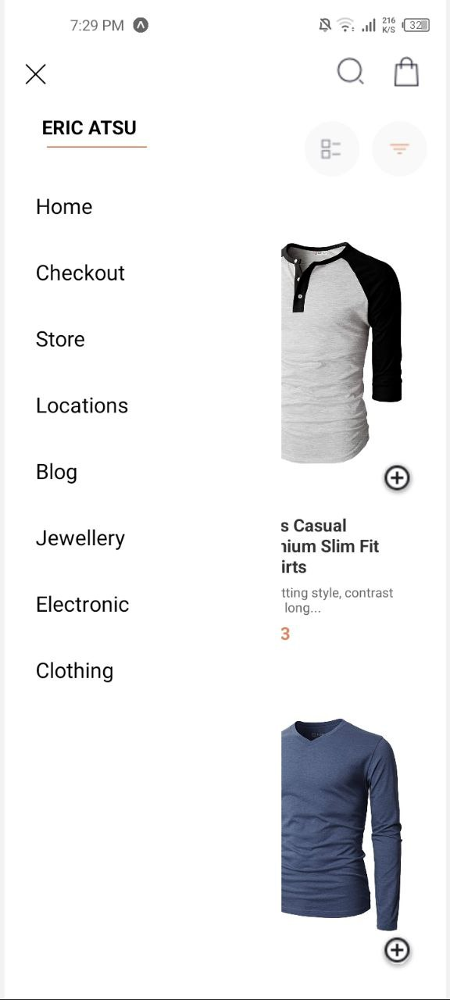

# DCIT 202 Assignment 7
- ### Raphael Quaye
- 11253474

# Open Fashion App 
The app fetches data from a fakestore api and provide them on the UI. You can basically add products to cart, romove products from cart, see the total amount of the cart, see details of each product, and have access to different screens.

## Overview
This app basically is a shopping app clone.


## Installation
1. Clone the repository.
```
https://github.com/AtaaNkpa20/rn-assignment7-11253474.git
```

2. Install dependencies with `npm install`.

## Usage
Provide instructions on how to use your application:
- How to start the app 
```
npm start
```

- Navigate through the app (e.g., swiping to access drawer, tapping product items).

## Technologies Used
- Expo
- Google Font
- React Async Storage
- React Drawer
- React Navigation
check the others in package.json

## Screenshots
### Home Screen


### Menu Button



### Checkout Page


### Product Details Screen


## Features
- Add products to cart
- Remove products from cart
- View product details
- View cart total
- View different screens

## Roadmap
- Add a payment method
- Implement a search bar
- Add a notification system
- Add a user profile section


## Contributing
1. Fork this repo
2. Code must clear, simple and well documented 
3. Create a pull request 


## License
Any reproduction of this code in either mechanical or digital means without my permission and acknowlegment is crime and may be subject to copyright. 